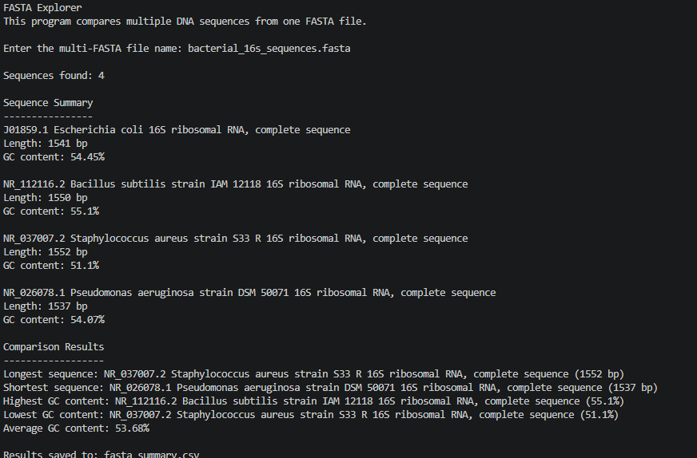

# FASTA Explorer

FASTA Explorer is my second beginner bioinformatics project.

The project builds on BioSeq Toolkit by moving from one DNA sequence to a FASTA file containing multiple real bacterial 16S rRNA gene sequences.

## Project Question

How do sequence length and GC content differ among complete 16S rRNA sequences from different bacterial species?

## What the Program Does

- reads multiple sequences from one FASTA file
- counts how many sequences are present
- calculates the length of each sequence
- calculates GC content for each sequence
- identifies the longest and shortest sequences
- identifies the highest and lowest GC content
- calculates the average GC content across all sequences
- saves the summary as a CSV file

## Species Included

- *Escherichia coli*
- *Bacillus subtilis*
- *Staphylococcus aureus*
- *Pseudomonas aeruginosa*

The accession numbers and sequence details are listed in `accession_sources.csv`.

## Project Files

```text
bioinformatics-project-01-fasta-explorer/
├── fasta_explorer.py
├── bacterial_16s_sequences.fasta
├── accession_sources.csv
├── fasta_summary.csv
├── images/
│   └── project_output.png
├── README.md
├── requirements.txt
├── LICENSE
└── .gitignore
```

## Data Source

The four complete 16S rRNA records are already included in `bacterial_16s_sequences.fasta`.

| Species | Accession | Record type | Database |
|---|---|---|---|
| *Escherichia coli* | [J01859.1](https://www.ncbi.nlm.nih.gov/nuccore/J01859.1) | Complete 16S rRNA | NCBI GenBank |
| *Bacillus subtilis* | [NR_112116.2](https://www.ncbi.nlm.nih.gov/nuccore/NR_112116.2) | Complete 16S rRNA | NCBI RefSeq |
| *Staphylococcus aureus* | [NR_037007.2](https://www.ncbi.nlm.nih.gov/nuccore/NR_037007.2) | Complete 16S rRNA | NCBI RefSeq |
| *Pseudomonas aeruginosa* | [NR_026078.1](https://www.ncbi.nlm.nih.gov/nuccore/NR_026078.1) | Complete 16S rRNA | NCBI RefSeq |

Using complete records makes the sequence-length comparison more meaningful than comparing a mixture of partial and complete records.

## How to Run

Run the analysis directly:

```bash
python fasta_explorer.py
```

When asked for the file name, enter:

```text
bacterial_16s_sequences.fasta
```

The program will also create:

```text
fasta_summary.csv
```

## Tested Results

The program successfully analyzed four sequences.

| Species | Length | GC content |
|---|---:|---:|
| *Escherichia coli* | 1541 bp | 54.45% |
| *Bacillus subtilis* | 1550 bp | 55.10% |
| *Staphylococcus aureus* | 1552 bp | 51.10% |
| *Pseudomonas aeruginosa* | 1537 bp | 54.07% |

### Comparison Summary

- Longest sequence: *Staphylococcus aureus* at 1552 bp
- Shortest sequence: *Pseudomonas aeruginosa* at 1537 bp
- Highest GC content: *Bacillus subtilis* at 55.10%
- Lowest GC content: *Staphylococcus aureus* at 51.10%
- Average GC content: 53.68%

## Program Output Screenshot



## What I Learned

This project helped me practice:

- reading and separating multiple FASTA records
- storing multiple biological sequences in a Python dictionary
- comparing sequence length and GC content across species
- calculating a dataset average
- exporting analysis results to CSV
- documenting public biological data with accession numbers

## Limitations

- The dataset contains only four bacterial 16S rRNA records.
- Length and GC content are descriptive properties and do not establish evolutionary relationships.
- The project does not perform sequence alignment, taxonomic classification, or phylogenetic analysis.

## Portfolio Progression

Previous project: [BioSeq Toolkit](https://github.com/pankhilpandya01-star/bioinformatics-project-00-seqtool)

Next project: [NCBI Sequence Fetcher](https://github.com/pankhilpandya01-star/bioinformatics-project-02-ncbi-sequence-fetcher)

## License

This project is available under the MIT License.
